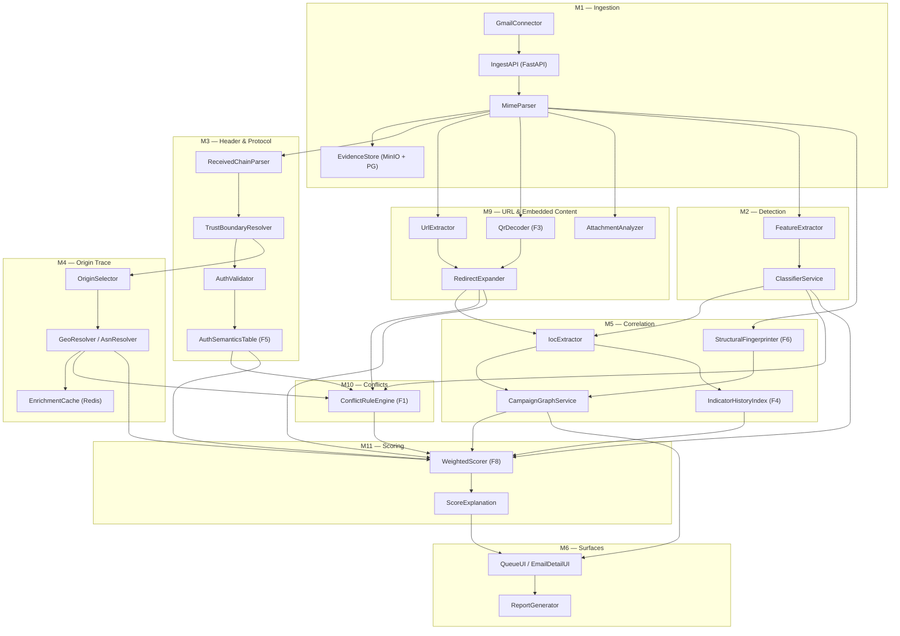
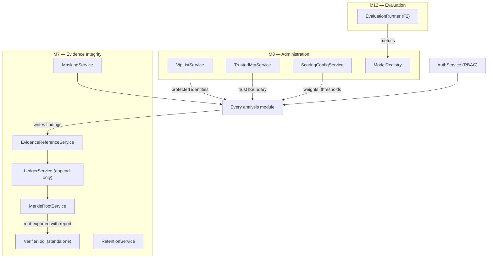
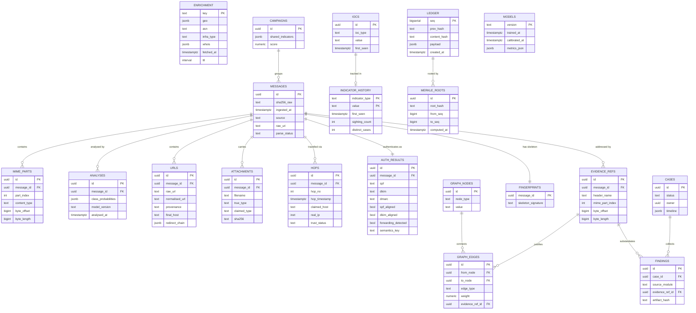
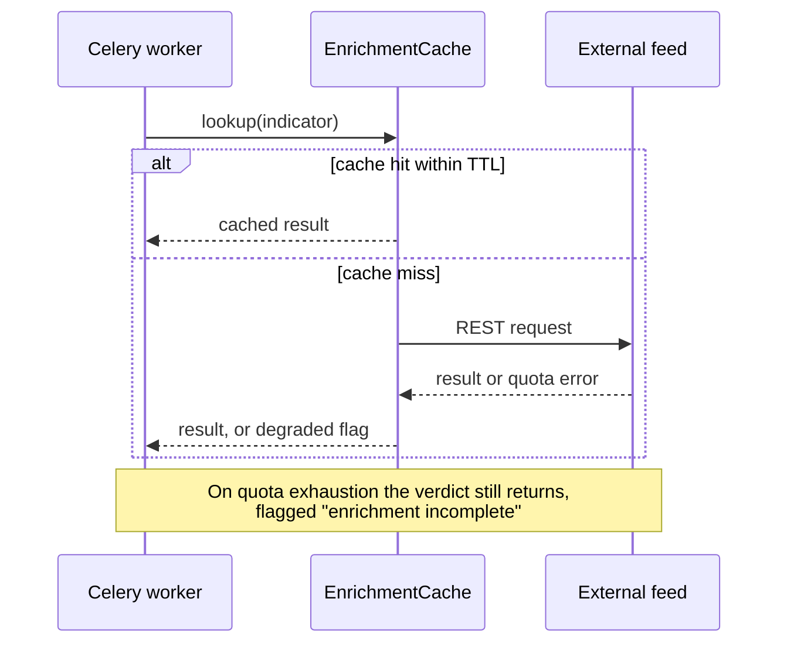
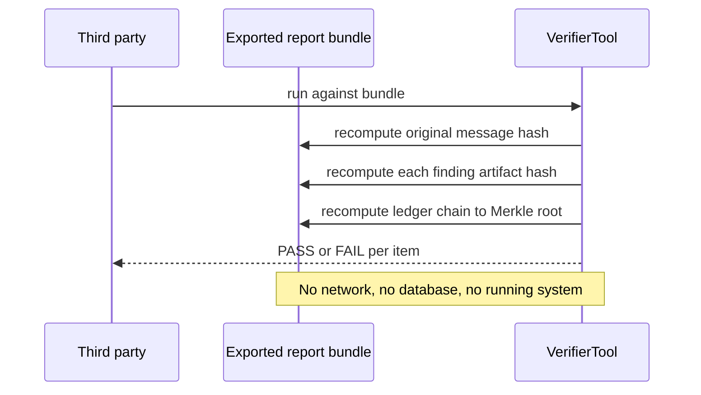

# Technical Architecture — DrishtiMail Forensics
**Prepared by:** fiftyfive technologies
**Date:** 2026-08-31
**Source:** arch.md (ARCH_PROPOSER output, revised 2026-08-31)

---

## Overview

An institutional email forensics platform. It ingests messages, classifies them, reconstructs the
delivery path with a trust boundary, traces the earliest reliable origin, correlates incidents
into campaigns, and produces forensic reports whose every finding is bound by database constraint
to a byte range in a write-once original. The tamper-evidence claim is the product's centre: an
append-only hash-chained ledger with periodic Merkle roots, verifiable by a standalone tool that
needs no access to the running system. Zero budget — everything is self-hosted open source.

---

## Tech Stack

| Layer | Decision | Status |
|---|---|---|
| Backend | FastAPI (Python 3.11) | ✓ Confirmed |
| Database | PostgreSQL | ✓ Confirmed — reversed from MongoDB 2026-08-31; the evidence design requires database-enforced append-only writes and constraint-enforced evidence references |
| Frontend | React + TypeScript | ✓ Confirmed |
| Queue / workers | Redis + Celery | ✓ Confirmed |
| Object storage | MinIO (object-lock) | ✓ Confirmed — write-once originals and exported reports |
| ML | scikit-learn baseline, DistilBERT embeddings, XGBoost fusion | ✓ Confirmed |
| Scoring | Weighted-additive model, hand-implemented | ✓ Confirmed — explanation is the requirement, so opaque aggregation is disqualified |
| Correlation graph | PostgreSQL recursive CTEs over a typed edge table | ✓ Confirmed — the safe default at prototype scale |
| Search | PostgreSQL full-text search | ✓ Confirmed |
| Tamper evidence | Hash-chained ledger table + periodic Merkle root | ✓ Confirmed — no external service, no distributed ledger |
| QR decoding | Open-source symbol reader | [STRAWMAN] — licence unresolved; ZBar is LGPL, PyMuPDF is AGPL |
| Geolocation | MaxMind GeoLite2 (offline DB) | ✓ Confirmed |
| Reporting | WeasyPrint | ✓ Confirmed |
| Infra | Docker Compose, self-hosted | ✓ Confirmed |

---

## Architecture Diagram

Note: the component count (~70) makes a single all-node diagram unreadable. Two views follow —
the per-message pipeline and the evidence/shared layer. The full component list is in the
inventory below.

### Per-message pipeline

### Evidence and shared layer

---

## Component Inventory

### M1 — Ingestion & Normalisation
- **IngestAPI** — FastAPI — `/ingest/upload`, `/ingest/headers`, `/analyze`. Depends on: MimeParser, EvidenceStore. Shared: no.
- **GmailConnector** — Python — mail platform API polling, the primary feed. Depends on: IngestAPI. Shared: no.
- **ImapConnector / JournalReceiver** — Python — secondary ingestion routes. Depends on: IngestAPI. Shared: no.
- **MimeParser** — Python — MIME tree to headers, bodies, attachments; malformed-tolerant. Depends on: none. Shared: no.
- **Deduplicator** — Python — Message-ID plus body hash. Depends on: MimeParser. Shared: no.
- **EvidenceStore** — MinIO + PostgreSQL — SHA-256 at ingest, write-once original, byte-offset addressing. Depends on: none. **Shared: yes — [M1, M6, M7]**.

### M2 — Detection Engine
- **FeatureExtractor** — Python — text, header and infrastructure feature families. Depends on: MimeParser, M3 outputs. Shared: no.
- **ClassifierService** — XGBoost + DistilBERT — six-class probability output. Depends on: FeatureExtractor. Shared: no.
- **SocialEngineeringDetector / BecPatternDetector** — Python — intent and fraud patterns. Depends on: MimeParser. Shared: no.
- **ImpersonationDetector** — Python — display name vs protected list. Depends on: VipListService. Shared: no.
- **LookalikeDomainDetector** — Python — homoglyph, IDN, edit distance, TLD swap. Depends on: TyposquatChecker. Shared: no.
- **ConcealmentDetector / ThreadHijackDetector / MultilingualAnalyzer** — Python. Depends on: MimeParser. Shared: no.
- **FeedbackQueue** — Celery — analyst corrections to retraining. Depends on: AuditLog. Shared: no.

### M3 — Header & Protocol Analysis
- **ReceivedChainParser** — Python — chronological hop reconstruction. Depends on: MimeParser. Shared: no.
- **TrustBoundaryResolver** — Python — earliest reliable node. Depends on: TrustedMtaService. **Shared: yes — [M3, M4]**.
- **AuthValidator** — Python — SPF, DKIM, DMARC with alignment. Depends on: DNS. Shared: no.
- **ArcEvaluator / AuthResultsCrosschecker** — Python. Depends on: AuthValidator. Shared: no.
- **HeaderAnomalyDetector / RelayCharacteristicDetector** — Python. Depends on: ReceivedChainParser. Shared: no.
- **AuthSemanticsTable** — data + Python — **F5**: the (SPF, DKIM, DMARC, alignments, forwarding) tuple returns establishes / does not establish / effect. Depends on: AuthValidator, ArcEvaluator. Shared: no.

### M4 — Origin Traceability & Location
- **OriginSelector** — Python — earliest reliable IP with written justification. Depends on: TrustBoundaryResolver. Shared: no.
- **GeoResolver** — GeoLite2 — country, region, city, accuracy radius. Depends on: EnrichmentCache. Shared: no.
- **AsnResolver / InfraClassifier** — Python. Depends on: EnrichmentCache. Shared: no.
- **DomainIntelService** — Python — WHOIS/RDAP, age, registrar, NS, MX. Depends on: EnrichmentCache. Shared: no.
- **PassiveDnsClient** — Python. Depends on: EnrichmentCache. Shared: no.
- **EnrichmentCache** — Redis — TTL cache, the quota defence. **Shared: yes — [M4, M5, M9]**.
- **TraceMapUI** — React + Leaflet — hop polylines, mandatory confidence banner. Depends on: OriginSelector. Shared: no.

### M5 — Investigation & Correlation Graph
- **IocExtractor** — Python. Depends on: MimeParser, M9. Shared: no.
- **ThreatIntelClient** — Python — optional, never load-bearing. Depends on: EnrichmentCache. Shared: no.
- **ThreatFeedImporter** — Python — manual CSV/Excel import. Shared: no.
- **IndicatorHistoryIndex** — PostgreSQL — **F4**: first-seen, sighting count, case count, familiarity band. **Shared: yes — [F4, F6]**.
- **FirstContactScorer** — Python — **F4**: capped low-weight signal with guard-rail assertion. Depends on: IndicatorHistoryIndex. Shared: no.
- **StructuralFingerprinter** — Python — **F6**: strips text, keeps HTML skeleton and attribute order, computes similarity signature. Depends on: MimeParser. Shared: no.
- **CampaignGraphService** — PostgreSQL recursive CTE — **F6**: typed nodes and edges, explainable shared-indicator scoring. Depends on: IocExtractor, StructuralFingerprinter. Shared: no.
- **OriginScenarioClassifier / AttributionSummarizer** — Python. Depends on: CampaignGraphService, M4. Shared: no.
- **IocExporter** — Python — STIX 2.1 / MISP / CSV. Depends on: IocExtractor. Shared: no.
- **GraphExplorerUI** — React + Cytoscape.js — pivot on node, every edge clickable to justifying evidence. Depends on: CampaignGraphService. Shared: no.

### M6 — Alerting, Dashboard & Reporting
- **AlertService** — Celery — threshold evaluation, channel fan-out. Depends on: WeightedScorer, ScoringConfigService. Shared: no.
- **QueueUI / EmailDetailUI / CaseUI / ExecutiveDashboardUI** — React. Depends on: CaseService, AuthService. Shared: no.
- **AuthSemanticsPanel / ConflictPanel / ScorePanel / LedgerPanel** — React — surfaces for F5, F1, F8, F7. Shared: no.
- **CaseService** — FastAPI — CRUD plus status workflow. Depends on: EvidenceStore, AuthService. Shared: no.
- **ReportGenerator** — WeasyPrint — forensic PDF, evidence-integrity page, Merkle root, per-finding references. Depends on: every analysis module, MerkleRootService. Shared: no.
- **CertificateTemplateService** — Python — BSA §63 template. Depends on: ReportGenerator. Shared: no.
- **SearchService** — PostgreSQL FTS. Shared: no.
- **EndUserReportIntake** — FastAPI. Depends on: IngestAPI. Shared: no.

### M7 — Evidence Integrity Layer
- **AuthService** — FastAPI + JWT — five-role RBAC. **Shared: yes — [every API and UI surface]**.
- **EvidenceReferenceService** — PostgreSQL — **F7 layer 1**: binds every finding to header name, MIME part index and byte offset. A finding without one cannot be written — NOT NULL plus foreign key. **Shared: yes — [every module producing a finding]**.
- **LedgerService** — PostgreSQL — **F7 layer 2**: append-only hash chain. Application role holds INSERT only; UPDATE and DELETE revoked and trigger-blocked. **Shared: yes — [every module producing a finding]**.
- **MerkleRootService** — Python — **F7 layer 3**: periodic root over rows since last root, exported with each report. Depends on: LedgerService. Shared: no.
- **VerifierTool** — standalone Python — recomputes original hash, artifact hashes and ledger chain. Depends on: nothing at runtime — that is the point. Shared: no.
- **MaskingService** — Python — default-on, audited reveal. **Shared: yes — [all UI]**.
- **RetentionService** — Celery — per-class purge with purge log. Shared: no.
- **ResidencyGuard** — config — storage-location enforcement. Shared: no.

### M8 — Administration
- **AdminAPI / AdminUI** — FastAPI / React. Depends on: AuthService. Shared: no.
- **VipListService** — protected brands and individuals. **Shared: yes — [M2, M8]**.
- **TrustedMtaService** — trusted internal mail servers. **Shared: yes — [M3, M8]**.
- **AllowBlockListService** — entries with expiry. Shared: no.
- **ScoringConfigService** — M11 weight ceilings, thresholds, F4 suppression floor. **Shared: yes — [M11, M6, M5]**.
- **ModelRegistry** — version, training date, calibration date, metrics from M12, rollback. Shared: no.

### M9 — URL & Embedded Content Threat Engine
- **UrlExtractor** — Python — hyperlinks from text and HTML. Depends on: MimeParser. Shared: no.
- **QrDecoder** — Python + symbol reader — **F3**: inline images, image attachments, rasterised document pages; grayscale, upscale, adaptive threshold, all four rotations. Depends on: MimeParser. Shared: no. **[STRAWMAN — licence]**
- **QrPresenceDetector** — Python — **F3**: emits "QR present, undecodable" on finder-pattern-without-decode. Shared: no.
- **UrlNormalizer** — Python — converges hyperlink and QR URLs into one set, provenance tagged. Shared: no.
- **RedirectExpander** — Python — shortener and redirect chain resolution. Depends on: EnrichmentCache. Shared: no.
- **DisplayDestinationComparator** — Python — anchor text vs resolved host. Shared: no.
- **TyposquatChecker** — Python. **Shared: yes — [M2, M9]**.
- **AttachmentAnalyzer** — Python, network-isolated container — static indicators only, never executed. Shared: no.

### M10 — Evidence Conflict Detector
- **ConflictRuleEngine** — Python — evaluates the rule table over module outputs. Depends on: M2, M3, M4, M5, M9. Shared: no.
- **ConflictRuleTable** — data — nine named conflict classes. Shared: no.
- **ConflictNarrator** — Python — renders each conflict quoting both sides. Depends on: ConflictRuleEngine. Shared: no.

### M11 — Explainable Threat Scoring
- **SignalNormalizer** — Python — per-family normalisation to a common strength scale. Shared: no.
- **WeightedScorer** — Python — weight × strength, conflict adjustment, clamped 0–100. Depends on: SignalNormalizer, ConflictRuleEngine, ScoringConfigService. Shared: no.
- **FirstContactGuard** — Python — assertion that removing first-contact signals cannot drop the verdict below threshold; downgrade and record if it does. Depends on: WeightedScorer. Shared: no.
- **ScoreExplanation** — Python — ranked contributions with point values, confidence band, fixed disclaimer, link per contribution to its evidence reference. Depends on: WeightedScorer, EvidenceReferenceService. Shared: no.

### M12 — ML Evaluation & Model Validation
- **EvaluationRunner** — Python — held-out split, per-class precision, recall, F1. Depends on: ClassifierService. Shared: no.
- **CorpusManifest** — data — test-set size and what the corpus does not cover. Shared: no.
- **EvaluationDashboardUI** — React — admin-only, off the per-message path. Depends on: EvaluationRunner. Shared: no.

---

## Data Model

**Two constraints carry the product's central claim and are not optional:**
`findings.evidence_ref_id` is `NOT NULL` with a foreign key — a finding without an evidence
reference cannot be inserted. The `ledger` table grants `INSERT` only to the application role,
with `UPDATE` and `DELETE` revoked and additionally blocked by trigger.

---

## Integration Points

| System | Approach | Risk | Open Questions |
|---|---|---|---|
| Institutional mail platform API | OAuth service account, scheduled poll | MED [STRAWMAN] | Is a test account provisioned? Which scopes are grantable? |
| QR decoding library | Bundled open-source symbol reader | MED [STRAWMAN] | ZBar is LGPL, PyMuPDF is AGPL — which, and does distribution change the answer? |
| Public phishing corpora | Offline download, held-out split | MED [STRAWMAN] | Licence terms for training and redistribution unconfirmed |
| Malicious-file reputation feed | REST, cached, enrich-on-miss | MED | ~5,760 lookups/day vs 10,000 messages/hour. Reduced severity — F4 and F6 need zero feed calls |
| WHOIS / RDAP | REST, cached | MED | Registrant fields redacted under GDPR — is domain age alone sufficient? |
| Passive DNS | REST, cached | MED | Which provider has a usable free tier? |
| Phishing URL feeds | REST, cached | LOW | One needs registration on unconfirmed terms; one is open |
| IP geolocation database | Offline DB, periodic refresh | LOW | Licence permits this use — confirm before distribution |
| Manual threat import | CSV/Excel upload | LOW | Column schema not yet defined |

---

## Build Order

**Foundations**
1. AuthService + PostgreSQL schema + LedgerService + EvidenceReferenceService — every finding needs both; retrofitting evidence references is not possible
2. EvidenceStore + MimeParser + IngestAPI — nothing is analysable before it is received, hashed and byte-addressable
3. TrustedMtaService + VipListService + ScoringConfigService — M3's trust boundary, M2's impersonation detection and M11's weights are undefined without them

**P0 — the demonstration depends on these**
4. MerkleRootService + VerifierTool — completes the evidence spine
5. ReceivedChainParser + TrustBoundaryResolver + AuthValidator + AuthSemanticsTable — cheapest build, highest explanatory value
6. UrlExtractor + RedirectExpander + DisplayDestinationComparator + QrDecoder — self-contained, no external dependency
7. FeatureExtractor + ClassifierService — M11 consumes its probabilities
8. SignalNormalizer + WeightedScorer + ScoreExplanation — needs F5 and M9 signals; a scorer with two inputs demonstrates worse than none
9. ConflictRuleEngine + ConflictNarrator — needs F5 and M2 outputs to compare

**P1**
10. EnrichmentCache + GeoResolver + AsnResolver + InfraClassifier + DomainIntelService + OriginSelector — cache first, or quota is exhausted in development
11. IocExtractor + StructuralFingerprinter + CampaignGraphService
12. IndicatorHistoryIndex + FirstContactScorer — rides on the index built above
13. CaseService + QueueUI + EmailDetailUI + the F1/F5/F7/F8 panels
14. ReportGenerator + CertificateTemplateService — renders every preceding output
15. TraceMapUI + GraphExplorerUI

**P2**
16. EvaluationRunner + CorpusManifest + EvaluationDashboardUI
17. AlertService + SearchService + EndUserReportIntake + IocExporter + remaining M2 detectors
18. MaskingService + RetentionService + ResidencyGuard + remaining M8 surfaces

---

## Open Questions

| # | Question | Blocks |
|---|---|---|
| 1 | What replaces the institution-donated training data? Public corpora reintroduce era-and-encoding bias; no non-English corpus identified | ClassifierService, EvaluationRunner, any accuracy claim |
| 2 | What are the success metrics for this build? M12 measures and discloses but commits to no target | Acceptance of every module |
| 3 | Which QR decoder, given the licence question? ZBar is LGPL, PyMuPDF is AGPL | QrDecoder, any release of the prototype |
| 4 | Is a mail platform account with API access provisioned? | GmailConnector, the primary ingestion route |
| 5 | Minimum history volume before the F4 first-contact signal is trusted? 1,000 proposed | FirstContactScorer suppression threshold |
| 6 | Who authors the F5 semantics prose? Needs one named owner | AuthSemanticsTable |
| 7 | Does the F8 conflict adjustment need its own calibration set? | WeightedScorer conflict weights |
| 8 | Retention rule for the F6 graph and F4 indicator index? | RetentionService policy for those stores |
| 9 | Are the public corpora licensed for training and redistribution? | EvaluationRunner, any published artifact |

---

## STRAWMAN Summary

All tentative decisions — verify before dev Sprint 1:

- [STRAWMAN] QR decoder selection — licence unresolved between an LGPL symbol reader and an AGPL rasteriser; matters on distribution
- [STRAWMAN] Public corpora as the sole training source — licence and representativeness both unconfirmed
- [STRAWMAN] Team allocation extended from the source document — that allocation covered six modules for a 36-hour build; it now covers twelve, and seniority is unstated
- [STRAWMAN] Relative sprint numbering — no calendar anchor exists; schedule stated as unbounded
- [STRAWMAN] M5 and M6 sized XL — auto-applied per sizing rule
- [STRAWMAN] Mail platform integration — test account unconfirmed
- [STRAWMAN] Graph on PostgreSQL recursive CTEs — the safe default at prototype scale; would change if traversal performance fails at demonstration size
- [STRAWMAN] F8 weight ceilings — taken as authored; not calibrated against any labelled set
