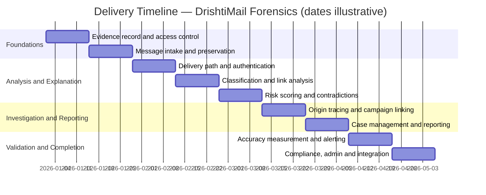

# Project Proposal — DrishtiMail Forensics
**Client:** Smart India Hackathon (problem statement SIH26106, AICTE — Cyber Security Cell)
**Prepared by:** fiftyfive technologies
**Date:** 2026-08-31
**Status:** Draft — pending client review

---

## 1. Executive Summary

Institutions can already block suspicious email, but they cannot explain it, trace where it came
from, or produce evidence an investigator or a court would accept. When a fraudulent invoice or a
message impersonating a senior official reaches staff, the security team can remove it and still
be unable to say who sent it, what infrastructure they used, or whether the same attacker has
struck before. This project delivers a system that examines each message, explains its verdict in
terms a reviewer can check, reconstructs the route the message travelled, links it to earlier
incidents, and produces a report whose every statement traces back to an exact location in the
original message — and whose integrity anyone can independently verify.

---

## 2. MVP Scope

### In Scope
| Capability | Description |
|---|---|
| Message intake and preservation | Accepts messages by upload, by pasted headers, and automatically from the institution's mail system. Every message is fingerprinted the moment it arrives and preserved unaltered, so everything that follows is provably derived from what was actually received. |
| Threat classification | Sorts each message into one of six categories, recognises the pressure tactics fraudsters use, identifies impersonation of named individuals and near-identical sender domains, works across languages, and learns from analyst corrections. |
| Delivery path and sender authentication | Reconstructs the chain of servers a message passed through, marks the portion an attacker could have forged, checks the sender's authentication records, and — critically — explains what each result does and does not prove. |
| Origin tracing and location | Identifies the earliest trustworthy point of origin with written justification, resolves it to a country, network operator and infrastructure type, and presents every location finding with an explicit confidence level and caveat. |
| Investigation and campaign linking | Recognises when separate incidents belong to the same campaign by the infrastructure and message structure they share, records whether an indicator has been seen at this institution before, and lets an investigator follow connections between related cases. |
| Analyst workspace and reporting | The queue, message detail view, case management, executive overview, search, staff reporting channel, and the exported forensic report with its admissibility certificate. |
| Evidence integrity | Binds every finding to an exact location in the preserved original, maintains a tamper-evident record that cannot be edited after the fact, and ships a standalone tool that lets any third party verify a report without access to our systems. |
| Administration | Maintains the lists of protected individuals and trusted internal servers, the scoring configuration, and the record of which analysis model is in use. |
| Link and embedded content analysis | Examines every link, wherever it came from — including codes embedded in images and document attachments — following redirects to the true destination and comparing what a reader sees against where the link actually leads. |
| Contradiction detection | Names the cases where the evidence disagrees with itself, quoting both sides — for example a message that is properly authenticated yet carries hostile content, which points to a compromised account rather than a forgery. |
| Explainable risk scoring | Produces a risk assessment where every contributing factor is listed with its actual weight, the figures visibly add up to the total, no single factor can trigger escalation alone, and the language never claims certainty. |
| Detection accuracy measurement | Reports the system's own measured accuracy on a stated test set, published alongside the size of that set and an explicit statement of what it does not cover. |

### Out of Scope (Phase 2)
| Capability | Reason |
|---|---|
| Identifying individual people behind an attack | A permanent boundary, not a deferral. The system attributes infrastructure and produces confidence-scored investigative leads; it never asserts who a person is, and the interface must never imply otherwise. |
| Blocking mail in transit | The system analyses a copy and never sits in the delivery path, so mail flow is never at risk. Blocking would be considered only once the system has been proven and trusted in live operation. |
| Opening suspicious files in a controlled environment | Files are examined without ever being run. A full detonation facility is a future integration, not part of this build. |
| Any action taken against attacker infrastructure | Take-downs, counter-attacks and active probing are excluded. The system only observes. |
| Device and network monitoring | Outside the email problem this system addresses. |
| Reading encrypted message content without the institution's own keys | Not technically possible without key custody. |
| Recording evidence fingerprints to an external public network | Unnecessary. The internal tamper-evident record achieves the same assurance at no cost and without depending on an outside service. |

---

## 3. Key User Journeys

1. **Security analyst** → opens a flagged email from the queue → reads the verdict, risk score and ranked contributing signals summing visibly to the total → closes it as low-risk or escalates it to a case, inside 30 seconds.
2. **Forensic investigator** → opens an escalated case → reads what the authentication result does and does not establish → walks the delivery path with untrustworthy hops marked → lands on the earliest reliable origin with its location, network operator, infrastructure type and domain age, each carrying a confidence level.
3. **Security analyst** → opens an email whose text contains no suspicious links → the system decodes a code embedded in an attached invoice image, follows its redirects and lands on a near-identical fake domain → the contradiction detector names the divergence between the code and the message body, quoting both sides.
4. **Analyst or investigator** → opens the investigation view → sees shared origin infrastructure and a matching message structure linking to earlier incidents → the campaign assembles with its shared indicators listed, and the history panel distinguishes a genuinely new sender from established infrastructure → follows a connection to a related case.
5. **Forensic investigator** → exports the report from a closed case, every finding carrying a reference to an exact location in the original message → a third party alters a single byte and runs the verification tool → it fails; the byte is restored → it passes.

---

## 4. High-Level Solution Overview

The system examines incoming email, decides how dangerous each message is and explains exactly
why, reconstructs the path the message travelled, estimates where it came from, links it to
earlier incidents, and produces a report whose every statement traces back to a specific location
in the original message. Work proceeds in three tiers: the evidence record and the explanation
layer first, then correlation across incidents, then measurement and validation. The system's
central claim is that its findings can be independently checked — a report exported today can be
verified by someone with no access to the system, and any later alteration is detectable. It runs
entirely on hardware the team already has, with no paid services anywhere in the design.

---

## 5. Delivery Timeline

⚠ **Calendar dates below are placeholders.** No start date has been set for this engagement. The
sprint *sequence* and the two-week *durations* are real and derived from the dependency order;
the specific dates are illustrative and will shift wholesale once a start date is agreed.

---

## 6. Budget

**Budget: nil.** This engagement is delivered at zero cost. Every component of the system is
open-source or free-tier, and the design deliberately excludes any paid or subscription service.
This is a hard constraint on the architecture, not merely an absence of funding.

---

## 7. Risks & Assumptions

### Key Risks

- **The system cannot be trained on the institution's own mail.** Privacy rules prevent real staff
  and student messages being used for training, so the detection model learns from publicly
  available collections instead. Those collections differ from institutional mail in age, style
  and format, so measured accuracy may not reflect real-world performance. This is the single
  largest risk to the system's effectiveness, and the accuracy measurement capability exists
  specifically so the gap is visible rather than hidden.

- **No collection of non-English fraudulent email has been identified.** Multi-language analysis
  is in scope, but the material to train and test it has not been found.

- **The licensing of the software that reads codes embedded in images is unresolved.** Two
  candidate components carry licence terms that would impose obligations if the system is
  distributed or published. This must be settled before any release.

- **The licensing of the public message collections is unconfirmed** for both training use and
  redistribution in a demonstration.

- **Access to the institution's mail system has not been arranged.** An account with the necessary
  permissions is required for automatic message collection; without it, messages can only be
  submitted by hand.

- **The team allocation is inherited from an earlier, much smaller plan.** It was written when the
  system was intended to be built in 36 hours; the scope has since roughly tripled, and no
  information about individual experience levels is available to assign the harder work
  deliberately.

- **No start date exists,** so the delivery calendar in Section 5 shows sequence and duration
  rather than actual dates.

- **Two capabilities carry the largest uncertainty** — the investigation and campaign-linking work,
  and the analyst workspace — because each combines a large number of parts. Both are flagged for
  review before development begins.

- **The risk-scoring weights have not been calibrated** against any measured set. They are
  professional judgement at this stage and are expected to be tuned.

### Assumptions

- An account with access to the institution's mail system will be made available for development
  and demonstration.
- The public message collections may lawfully be used for training and shown in a demonstration.
- The free service tiers the system relies on remain available and unchanged for the duration of
  the build.
- The location database and other open components remain free under terms compatible with this use.
- The components that read embedded codes and document files may be included under their licences.
- Searching connections between incidents performs adequately at demonstration scale.
- The demonstration data is prepared and stored in advance; nothing shown depends on an outside
  service responding at the time.
- The delivery team is six people.

---

## 8. Success Metrics

**Not yet agreed.** No measurable target has been set for any capability.

The system measures and publishes its own detection accuracy — precision, recall and per-category
performance on a stated test set, shown alongside the size of that set and an explicit statement
of what the set does not cover. That is a commitment to honest measurement, not a commitment to a
number. Targets should be agreed before acceptance.

---

## 9. Delivery Team

Six engineers, allocated by area of ownership:

- 1 × Engineer — message intake, parsing, delivery-path and authentication analysis
- 1 × Engineer — detection model and accuracy measurement
- 1 × Engineer — origin tracing, location, enrichment, link and embedded-content analysis
- 1 × Engineer — investigation graph, campaign linking, sender history
- 1 × Engineer — user interface across queue, detail, case, map and investigation views
- 1 × Engineer — evidence record, reporting, contradiction detection, risk scoring

⚠ Experience levels are not recorded in the scoping documents, so no seniority is stated above.

---

## 10. Sign-Off

By signing below, both parties confirm that this proposal accurately reflects the agreed
scope and that work will commence following the resolution of any outstanding pre-conditions.

| | |
|---|---|
| **Smart India Hackathon** | |
| Name: | __________________ |
| Title: | __________________ |
| Date: | __________________ |
| | |
| **fiftyfive technologies** | |
| Name: | __________________ |
| Title: | __________________ |
| Date: | __________________ |
