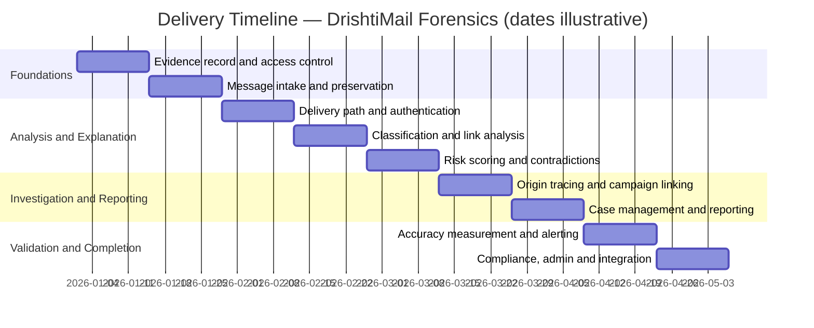

# Scope Agreement — DrishtiMail Forensics
**Client:** Smart India Hackathon (problem statement SIH26106, AICTE — Cyber Security Cell)
**Prepared by:** fiftyfive technologies
**Date:** 2026-08-31
**Status:** Pending client sign-off

---

## 1. Problem Statement

Institutions can block malicious email but cannot explain it, trace it, or evidence it. When a
fraudulent invoice or a message impersonating a senior official arrives, the security team can
quarantine it and still not answer where it came from, which infrastructure sent it, whether it
matches a prior incident, or how to hand it to law enforcement in a usable form. Four gaps drive
this: no reading of intent independent of specific wording; delivery records stored but never
reconstructed into a trustworthy path; every incident treated in isolation; and no chain of
custody, so findings do not survive legal or disciplinary scrutiny. This system closes all four.

---

## 2. Users

| Role | Usage |
|---|---|
| Security analyst | Primary daily user. Handles roughly 60–100 flagged messages a day and needs a verdict with its reasons in under 30 seconds. |
| Forensic investigator | Escalation path. Needs the delivery route reconstructed, the origin identified, and evidence that will withstand review. |
| Mail administrator | Deploys and configures the system. Requires that mail delivery is never placed at risk. |
| Institutional head / registrar | Sponsor and risk owner. Uses the overview dashboard to see institutional exposure without reading individual messages. |
| Staff, faculty and students | The protected party. Can report a suspicious message directly into the analyst queue. |
| Law enforcement / cybercrime cell | Consumes exported forensic reports. |
| Legal, data protection and compliance | Governs retention, access and disclosure. |
| National cyber agency | Recipient of incident reporting and subject of log-retention obligations. |

---

## 3. MVP Scope

### In Scope
| Capability | Description |
|---|---|
| Message intake and preservation | Accepts messages by upload, by pasted headers, and automatically from the institution's mail system. Every message is fingerprinted on arrival and preserved unaltered. |
| Threat classification | Sorts each message into one of six categories, recognises fraudsters' pressure tactics, identifies impersonation of named individuals and near-identical sender domains, works across languages, and learns from analyst corrections. |
| Delivery path and sender authentication | Reconstructs the chain of servers a message passed through, marks the portion an attacker could have forged, checks the sender's authentication records, and explains what each result does and does not prove. |
| Origin tracing and location | Identifies the earliest trustworthy point of origin with written justification, resolves it to a country, network operator and infrastructure type, and presents every location finding with an explicit confidence level and caveat. |
| Investigation and campaign linking | Recognises when separate incidents belong to one campaign through shared infrastructure and message structure, records whether an indicator has been seen here before, and lets an investigator follow connections between cases. |
| Analyst workspace and reporting | Queue, message detail view, case management, executive overview, search, staff reporting channel, and the exported forensic report with its admissibility certificate. |
| Evidence integrity | Binds every finding to an exact location in the preserved original, maintains a record that cannot be edited after the fact, and ships a standalone tool letting any third party verify a report without access to our systems. |
| Administration | Maintains the lists of protected individuals and trusted internal servers, the scoring configuration, and the record of which analysis model is in use. |
| Link and embedded content analysis | Examines every link wherever it came from — including codes embedded in images and document attachments — following redirects to the true destination and comparing what a reader sees against where the link leads. |
| Contradiction detection | Names cases where the evidence disagrees with itself, quoting both sides — for example a properly authenticated message carrying hostile content, which points to a compromised account rather than a forgery. |
| Explainable risk scoring | Produces an assessment where every contributing factor is listed with its weight, the figures visibly add up, no single factor can trigger escalation alone, and the language never claims certainty. |
| Detection accuracy measurement | Reports the system's own measured accuracy on a stated test set, published with the size of that set and an explicit statement of what it does not cover. |

### Out of Scope (Phase 2)
| Capability | Reason |
|---|---|
| Identifying individual people behind an attack | A permanent boundary, not a deferral. The system attributes infrastructure and produces confidence-scored investigative leads; it never asserts who a person is. |
| Blocking mail in transit | The system analyses a copy and never sits in the delivery path. Blocking would be considered only after the system is proven in live operation. |
| Opening suspicious files in a controlled environment | Files are examined without ever being run. A full detonation facility is a future integration. |
| Any action taken against attacker infrastructure | Take-downs, counter-attacks and active probing are excluded. The system only observes. |
| Device and network monitoring | Outside the email problem this system addresses. |
| Reading encrypted message content without the institution's own keys | Not technically possible without key custody. |
| Recording evidence fingerprints to an external public network | Unnecessary — the internal tamper-evident record achieves the same assurance at no cost and without an outside dependency. |

---

## 4. Key User Journeys

1. **Security analyst** → opens a flagged email from the queue → reads the verdict, risk score and ranked contributing signals summing visibly to the total → closes it as low-risk or escalates it to a case, inside 30 seconds.
2. **Forensic investigator** → opens an escalated case → reads what the authentication result does and does not establish → walks the delivery path with untrustworthy hops marked → lands on the earliest reliable origin with its location, network operator, infrastructure type and domain age, each carrying a confidence level.
3. **Security analyst** → opens an email whose text contains no suspicious links → the system decodes a code embedded in an attached invoice image, follows its redirects and lands on a near-identical fake domain → the contradiction detector names the divergence between the code and the message body, quoting both sides.
4. **Analyst or investigator** → opens the investigation view → sees shared origin infrastructure and a matching message structure linking to earlier incidents → the campaign assembles with its shared indicators listed, and the history panel distinguishes a genuinely new sender from established infrastructure → follows a connection to a related case.
5. **Forensic investigator** → exports the report from a closed case, every finding carrying a reference to an exact location in the original message → a third party alters a single byte and runs the verification tool → it fails; the byte is restored → it passes.

---

## 5. Delivery Timeline

⚠ **Calendar dates below are placeholders.** No start date has been agreed. The sequence and the
two-week durations are real and derived from what must be built before what; the specific dates
are illustrative and will shift wholesale once a start date is set.

---

## 6. Constraints

- **Budget:** nil. The engagement is delivered at zero cost, and the design deliberately excludes
  any paid or subscription service. This is a hard constraint on what can be built, not merely an
  absence of funding.
- **Infrastructure:** the system runs entirely on hardware the team already holds. Nothing is
  hosted with an external provider, which also satisfies the requirement that evidence and logs
  remain within national jurisdiction.
- **User interface:** browser-based. There is no software for users to install.
- **Integrations:** message collection from the institution's existing mail service; reference
  lookups against freely available reputation, domain-registration and location data sources, all
  cached to stay within their usage limits; and a facility to import threat information by
  spreadsheet where an automated source is unavailable.
- **Mail flow:** the system analyses a copy and never sits in the delivery path. Mail delivery is
  never delayed or placed at risk.
- **Data retention:** delivery records held for one year, message content for 90 days, both
  configurable by the institution.
- **Compliance:** designed against national data-protection law, the national cyber agency's
  reporting and log-retention directions, and the evidentiary requirements for electronic records.
- **Timeline:** no fixed deadline. Scope is fixed and schedule is open.

---

## 7. Assumptions

- An account with access to the institution's mail service will be made available for development
  and demonstration.
- The publicly available collections of fraudulent email may lawfully be used to train and test
  the system, and shown in a demonstration. It is assumed this is permitted; it will be confirmed
  before the material is used.
- It is assumed that suitable material exists to train the system for languages other than
  English. None has yet been identified, and this will be confirmed early.
- The free usage tiers the system relies on remain available and unchanged for the duration of
  the build.
- It is assumed that the components used to read codes embedded in images may be included under
  their licence terms — this will be confirmed before any release of the system.
- It is assumed that searching connections between incidents will perform adequately at
  demonstration scale; this will be confirmed during the investigation-linking work.
- It is assumed that the risk-scoring weights, which are currently professional judgement, are
  acceptable for a prototype and will be tuned once real results exist.
- Demonstration data is prepared and stored in advance; nothing shown depends on an external
  service responding at the time.
- The delivery team is six engineers. Experience levels are not recorded, so work is allocated by
  subject area rather than by capability.
- The delivery schedule assumes full-time availability from each engineer.

---

## 8. Pre-conditions for Project Start

| # | Pre-condition | Owner | Status |
|---|---|---|---|
| 1 | Provide an account with access to the institution's mail service, with the permissions needed to collect messages | Client | Outstanding |
| 2 | Agree the measurable targets the finished system will be accepted against | Client | Outstanding |
| 3 | Confirm the retention rule for indicator history and investigation records — this data is most useful when kept longest and most sensitive when kept at all | Client | Outstanding |
| 4 | Decide the volume of message history required before the "not seen here before" signal is trusted rather than suppressed | Client | Outstanding |
| 5 | Confirm the licensing position for the public collections used to train and test the system, for both use and demonstration | fiftyfive | Outstanding |
| 6 | Select the components used to read codes embedded in images, and confirm their licence terms permit distribution | fiftyfive | Outstanding |
| 7 | Identify suitable training material for languages other than English, or agree to narrow that capability | fiftyfive | Outstanding |
| 8 | Assign one named person to author the explanatory text that accompanies authentication results — this is the most user-visible writing in the product and must be technically exact | fiftyfive | Outstanding |
| 9 | Decide whether the contradiction-adjustment weights require their own calibration, or whether professional judgement is acceptable for a prototype | fiftyfive | Outstanding |

---

## 9. Success Metrics

**Not yet agreed.** No measurable target has been set for any capability, and pre-condition 2
above exists to resolve that.

The system measures and publishes its own detection accuracy — per-category performance on a
stated test set, shown alongside the size of that set and an explicit statement of what the set
does not cover. That is a commitment to honest measurement rather than to a particular number.
It is expected that the measured figures may not reflect performance on the institution's own
mail, because the institution's mail cannot be used for training.

---

## 10. Sign-Off

By signing below, both parties confirm that the scope described in this document is agreed
and that work will not commence until pre-conditions in Section 8 are resolved.

| | |
|---|---|
| **Smart India Hackathon** | |
| Name: | __________________ |
| Title: | __________________ |
| Date: | __________________ |
| | |
| **fiftyfive technologies** | |
| Name: | __________________ |
| Title: | __________________ |
| Date: | __________________ |
