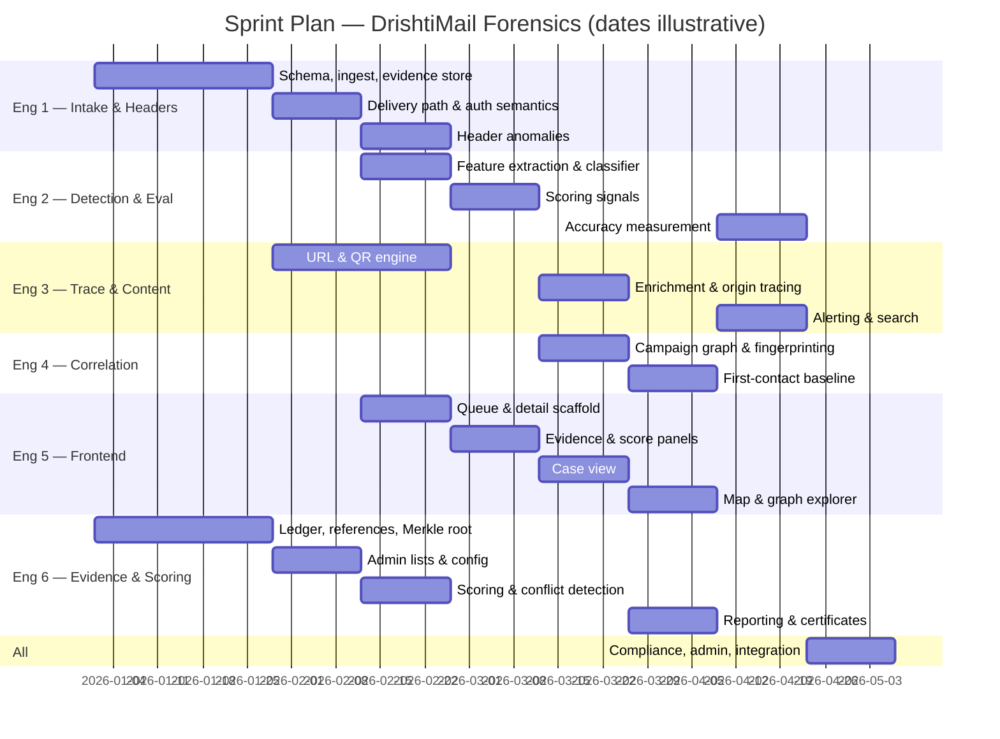

# Sprint Plan — DrishtiMail Forensics
**Prepared by:** fiftyfive technologies
**Date:** 2026-08-31
**Source:** arch.md Sprint Mapping

---

## Team

Six engineers, allocated by ownership area. Seniority is not recorded in any source document,
so no experience levels are stated — this matters, because integration-heavy work should
normally be assigned deliberately rather than by area alone.

| # | Owner | Area |
|---|---|---|
| 1 | Engineer 1 | Ingestion, parsing, delivery path and authentication (M1, M3) |
| 2 | Engineer 2 | Detection model, accuracy measurement (M2, M12) |
| 3 | Engineer 3 | Origin tracing, geolocation, enrichment, URL and QR engine (M4, M9) |
| 4 | Engineer 4 | Correlation graph, campaign linking, sender history (M5) |
| 5 | Engineer 5 | Frontend — queue, detail, panels, map, graph, case view (M6) |
| 6 | Engineer 6 | Evidence ledger, reporting, conflict detection, scoring (M7, M10, M11) |

---

## Sprint Calendar

⚠ **Calendar dates below are placeholders.** No start date exists for this engagement. Sprint
*sequence* and two-week *durations* are real and dependency-derived; the dates shift wholesale
once a start date is agreed.

---

## Sprint Breakdown

| Sprint | Dates (illustrative) | Deliverables | Owner |
|---|---|---|---|
| 1 | 2026-01-01 → 01-14 | PostgreSQL schema, AuthService, LedgerService, EvidenceReferenceService, EvidenceStore | 6, 1 |
| 2 | 2026-01-15 → 01-28 | MimeParser, IngestAPI, GmailConnector, Deduplicator ∥ MerkleRootService, VerifierTool — evidence spine complete | 1 ∥ 6 |
| 3 | 2026-01-29 → 02-11 | ReceivedChainParser, TrustBoundaryResolver, AuthValidator, AuthSemanticsTable ∥ UrlExtractor, RedirectExpander, QrDecoder ∥ admin lists | 1 ∥ 3 ∥ 6 |
| 4 | 2026-02-12 → 02-25 | FeatureExtractor, ClassifierService ∥ DisplayDestinationComparator, TyposquatChecker, AttachmentAnalyzer ∥ QueueUI, EmailDetailUI scaffold, AuthSemanticsPanel | 2 ∥ 3 ∥ 5 |
| 5 | 2026-02-26 → 03-11 | SignalNormalizer, WeightedScorer, ScoreExplanation ∥ ConflictRuleEngine, ConflictNarrator ∥ ScorePanel, ConflictPanel, LedgerPanel | 2, 6 ∥ 6 ∥ 5 |
| 6 | 2026-03-12 → 03-25 | EnrichmentCache, GeoResolver, AsnResolver, InfraClassifier, DomainIntelService, OriginSelector ∥ IocExtractor, StructuralFingerprinter, CampaignGraphService ∥ CaseService, CaseUI | 3 ∥ 4 ∥ 5, 6 |
| 7 | 2026-03-26 → 04-08 | IndicatorHistoryIndex, FirstContactScorer ∥ ReportGenerator, CertificateTemplateService ∥ TraceMapUI, GraphExplorerUI | 4 ∥ 6 ∥ 5 |
| 8 | 2026-04-09 → 04-22 | EvaluationRunner, CorpusManifest, EvaluationDashboardUI ∥ remaining M2 detectors, multilingual, FeedbackQueue ∥ AlertService, SearchService, EndUserReportIntake, IocExporter | 2 ∥ 2 ∥ 3, 5 |
| 9 | 2026-04-23 → 05-06 | MaskingService, RetentionService, ResidencyGuard, ExecutiveDashboardUI, remaining M8, ArcEvaluator, PassiveDnsClient, integration testing, demo seeding | all |

---

## Dependency Map

| Component / Deliverable | Must complete before |
|---|---|
| AuthService, LedgerService, EvidenceReferenceService | Every module that produces a finding — the evidence reference cannot be retrofitted |
| PostgreSQL schema | All persistence work in every module |
| EvidenceStore, MimeParser, IngestAPI | All analysis — nothing is analysable before it is received, hashed and byte-addressable |
| TrustedMtaService | TrustBoundaryResolver, and therefore all of M4 origin tracing |
| VipListService | ImpersonationDetector |
| ScoringConfigService | WeightedScorer, AlertService, FirstContactScorer |
| MerkleRootService | VerifierTool, ReportGenerator's integrity page |
| TrustBoundaryResolver | OriginSelector — origin selection *is* choosing the earliest reliable hop |
| AuthSemanticsTable | ConflictRuleEngine, WeightedScorer — both consume its output |
| UrlExtractor, RedirectExpander, QrDecoder | ConflictRuleEngine (QR-vs-body divergence), WeightedScorer (URL risk family) |
| ClassifierService | ConflictRuleEngine (authentication-vs-content conflicts), WeightedScorer, EvaluationRunner |
| ConflictRuleEngine | WeightedScorer — conflicts adjust the score rather than adding to it |
| WeightedScorer, ScoreExplanation | EmailDetailUI, AlertService, ReportGenerator |
| EnrichmentCache | GeoResolver, DomainIntelService, ThreatIntelClient, RedirectExpander — build it first or exhaust the quota in development |
| IocExtractor, StructuralFingerprinter | CampaignGraphService |
| CampaignGraphService, IndicatorHistoryIndex | FirstContactScorer, GraphExplorerUI |
| CaseService | ReportGenerator, CaseUI |
| Every analysis module | ReportGenerator — the report renders all of their output |
| EvaluationRunner | ModelRegistry metrics |

---

## Risk Flags

| Sprint | STRAWMAN Risk | Impact if unresolved |
|---|---|---|
| 3 | QR decoder selection — licence unresolved between two candidate components | Sprint 3 may need to change decoding approach mid-build, or the finished system may be undistributable. Cheapest to settle before Sprint 3 begins, not during it. |
| 4, 8 | Public collections as the sole training source — licence and representativeness both unconfirmed | Detection quality may not reflect real institutional mail, and the accuracy figures published in Sprint 8 may not be publishable at all if licensing forbids it. |
| 2 | Mail platform access — no test account confirmed | Automatic message collection cannot be built or demonstrated in Sprint 2. Manual submission still works, so the build continues, but the primary intake route is untested. |
| 5 | Scoring weights taken as authored, never calibrated | The risk scores shown from Sprint 5 onward are professional judgement, not measured. Expect tuning once real results exist. |
| 6, 7 | Correlation and analyst workspace both sized extra-large | These two sprints carry the most uncertainty in the plan. If either overruns, the reporting and visualisation work in Sprint 7 slips with it. |
| 6 | Connection-searching performance on the chosen storage approach | If traversal is slow at demonstration scale, the investigation view may need a different storage approach mid-build. |
| All | Team allocation inherited from a much smaller plan; no experience levels recorded | Work is assigned by subject area rather than by capability. Harder integration work may land with whoever owns the area rather than whoever is best placed to do it. |
| All | No start date | This calendar shows sequence and duration only. Any date-dependent commitment made from it will be wrong. |

---

## Planning Assumptions

- **Full-time availability.** Each engineer is shown on a continuous track. For a student team
  this is almost certainly optimistic, and it is the assumption most likely to make this calendar
  wrong even after a start date is set.
- **Parallel tracks from Sprint 3.** Before that, work converges on the evidence spine and intake,
  which are shared dependencies.
- **Two-week cadence** throughout, per the source sprint mapping.
- **Sprints 6 and 7 are the tightest point in the plan** — both extra-large modules land there,
  along with the reporting and visualisation work that depends on them.
